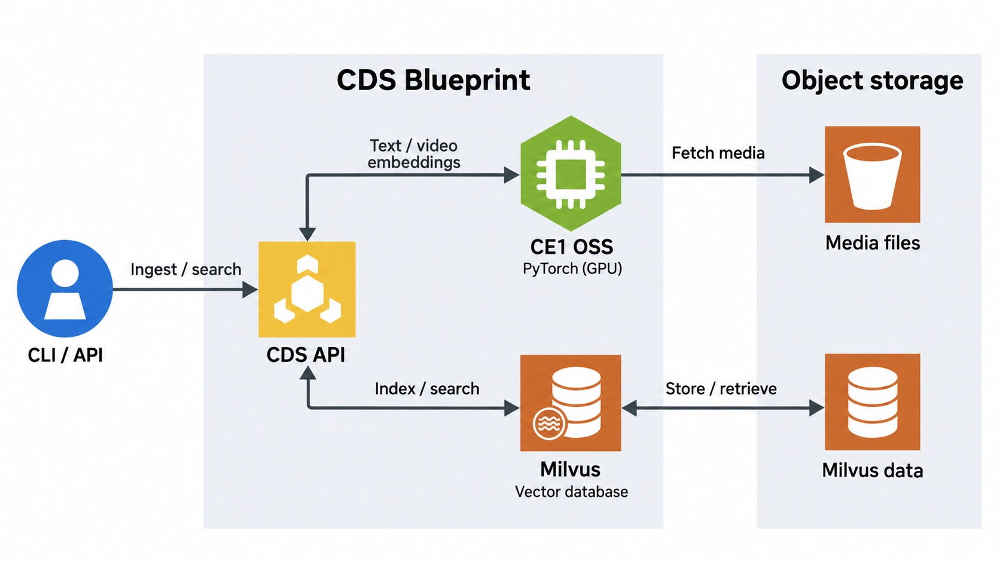

# CDS 1.2.0 architecture

CDS is a customer-managed blueprint: the visual-search API coordinates ingestion and search, the CE1 OSS service produces embeddings, and Milvus stores vectors and collection metadata.

For supported media sources and private-storage configuration, see [ingestion source settings](import-url-security.md).

## Request flow

1. A client calls CDS through the customer's access-control and TLS boundary. A direct CE1 endpoint, if exposed, needs the same protection.
2. CDS sends text or video embedding requests to CE1. Text bypasses video decoding. Video is materialized, checked by system `ffprobe`, GPU-decoded with PyNvVideoCodec, uniformly sampled to eight frames and resized for the 224p model. The service returns normalized 256-dimensional embeddings.
3. CDS writes or searches vectors and metadata in Milvus. Collection metadata lives in Milvus's `_collection_registry`; this release does not require a separate PostgreSQL metadata service.
4. Media may come from base64 input or supported URLs, including presigned object-storage URLs. Optional text and S3 Parquet imports use separate CDS-side validation. Media CDN integration is optional, not required for basic ingestion/search.

## Model and deployment boundaries

- The two [NGC 1.2.0 images](release-containers.md) contain service code and dependencies, not model weights. Operators provision the pinned CE1 snapshot separately.
- Model files are mounted read-only and verified before loading. The Hugging Face module cache is a separate writable local directory, not an external service. Runtime model downloads are disabled by default.
- Kubernetes Secret API reads use only explicitly allowed names. Kubelet-injected secrets and AWS IAM permissions are separate mechanisms.
- Kubernetes ingress adds the `/api` prefix; standalone Compose exposes the service directly. Internal HTTP links are not authentication boundaries.
- Authentication, authorization, trusted TLS certificates, ingress/egress restrictions and operational monitoring remain customer responsibilities. The diagram is not a claim that the default deployment is production-hardened.

See [AWS EKS deployment](aws-eks-deployment.md), [Compose deployment](docker-compose-deployment.md), and the [API reference](api_reference.md).
